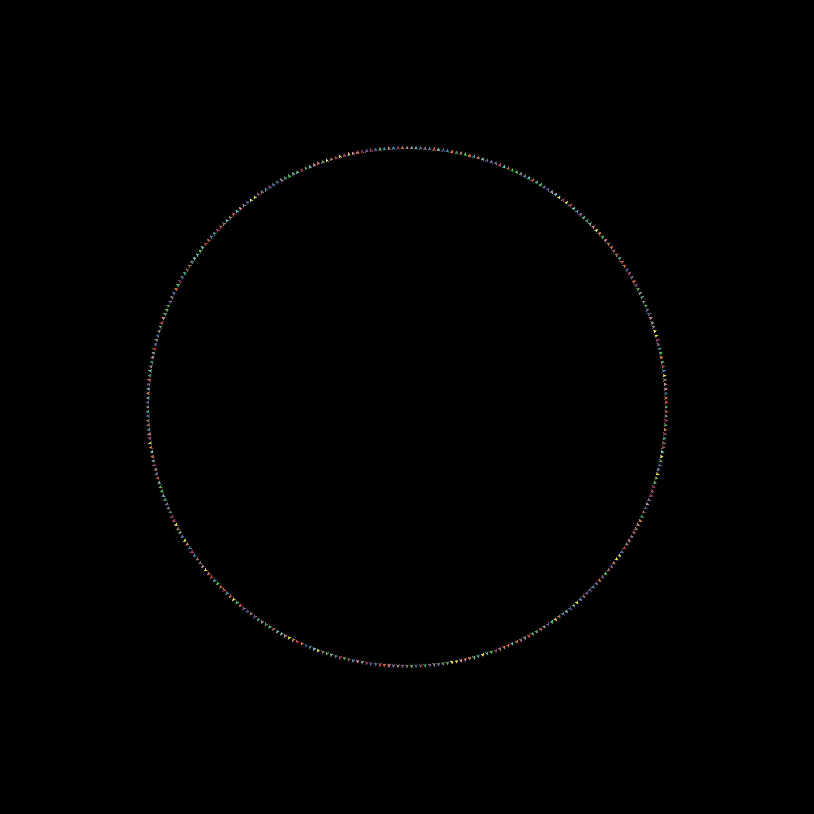
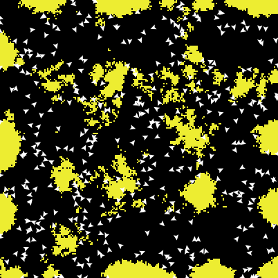

% Report on HLogo (NetLogo clone in Haskell)
% Nikolaos Bezirgiannis, Ilias Sakellariou, Wishnu Prasetya
% 07/04/2013

# News

Support Breeds, Links
  : Added basic support for breeds and links
API completion
  : Nearly whole API porting, even imperative primitives like `while, loop, foreach`
    ([API Documentation](http://bezirg.net/hlogo/doc/))
Unit Testing the Framework
  : Done unit & regression testing by replicating the unit tests of
    [NetLogo codebase](https://github.com/NetLogo/NetLogo/tree/master/test/commands)

    The failed tests are mostly because of current limitations of HLogo ([listed here](https://wiki.bezirg.net/MasterThesis/HLogo%20Limitations))
    Note:  Username: thesis Password: thesis
Visualizer
  : I implemented a visualizer that takes snapshots of the 2D grid and
     spits out EPS,PNG
Benchmarking
  : Created custom, relatively simple (deterministic) examples to benchmark HLogo vs NetLogo.
    Ported the Termites and WolfSheep models from the Standard Models Library of NetLogo to HLogo.
    Then ran benchmarks on them too.
Profiling
  : Profiled the benchmark code for space and time. Fixed an issue with the GHC Garbage Collector, by incrementing the heap allocation area.

# Results of Benchmarking

## Simple1 model

### Description

Spawn 100000 turtles, and for 8 ticks let them behave. Their behaviour
is to do rudimentary moving on the grid.

### NetLogo code

~~~ {.numberLines}
to setup
  reset-timer
  reset-ticks
  create-turtles 100000
end

to go
  if (ticks = 8) [print timer stop]
  ask turtles [behave]
  tick
end

to behave
         fd 1
         fd 1
         back 1
         forward 1
         fd 1
         fd 1
         back 1
         forward 1
         fd 1
         fd 1
         back 1
         forward 1
         fd 1
         fd 1
         back 1
         forward 1   
end
~~~

### Translated HLogo code

~~~ {.haskell .numberLines}
setup = do
  atomic $ create_turtles 100000
  atomic $ reset_ticks

go = forever $ do
  t <- unsafe_ticks
  when (t==8) $ stop
  ask_ (behave) =<< unsafe_turtles
  unsafe_show_ t
  atomic $ tick

behave = do
   atomic $ do 
           (forward 1 >> forward 1)
           (back 1 >> forward 1)
   atomic $ do 
           (forward 1 >> forward 1)
           (back 1 >> forward 1)
   atomic $ do 
           (forward 1 >> forward 1)
           (back 1 >> forward 1)
   atomic $ do 
           (forward 1 >> forward 1)
           (back 1 >> forward 1)

run ['setup, 'go]
~~~

### Results

- Benchmark Results on win 32bit (intel i7 3537U)

Model       NetLogo (secs)  NetLogo (JVM bytecode)  HLogo (1-core)  HLogo (2-cores) 
-----       --------------  ----------------------  --------------  ---------------
Simple1     18.6            16.4                    4.4             2.6

## Simple2 model

### Description

10000 turtles are moving forward 1 step on every tick. If they are on a red patch, they also
turn left by 30 degrees. If they are on a blue patch, they turn right by 30 degrees.
The benchmarking stop after 1000 ticks.

### NetLogo code

~~~ {.numberLines}
to setup
  clear-all
  reset-timer
  
  ask patches [set pcolor one-of [black black black black black black black black red blue]]
  
  create-turtles 10000
  ask turtles [setxy random-xcor random-ycor]
  reset-ticks
end
  
to go
  if (ticks = 1000) [print timer stop]
  ask turtles [behave]
  tick
end

to behave
  let p pcolor
  fd 1
  ifelse (p = red)
    [lt 30]
    [if (p = blue) [rt 30]]
end
~~~

### HLogo code

~~~ {.haskell .numberLines}
globals []
patches_own []
turtles_own []

setup = do
  ask_ (do
         [c] <- unsafe_one_of [black, black, black, black, black, black, black, black, red, blue]
         atomic $ set_pcolor c) =<< unsafe_patches
  atomic $ create_turtles 10000
  atomic $ reset_ticks

go = forever $ do
  t <- unsafe_ticks
  when (t==1000) $ stop
  ask_ (behave) =<< unsafe_turtles
  atomic $ tick

behave = do
  c <- unsafe_pcolor
  atomic $ fd 1 >> if c == red
                   then lt 30
                   else when (c == blue) (rt 30)

run ['setup, 'go]
~~~

### Results

- Benchmark Results on win 32bit (intel i7 3537U)

Model       NetLogo (secs)  NetLogo (JVM bytecode)  HLogo (1-core)  HLogo (2-cores, 4threads) 
-----       --------------  ----------------------  --------------  -------------------------
Simple2     8.9             7.4                     16              7.2

## Termites model

### Description

This project is inspired by the behavior of termites gathering wood chips into piles. The termites follow a set of simple rules. Each termite starts wandering randomly. If it bumps into a wood chip, it picks the chip up, and continues to wander randomly. When it bumps into another wood chip, it finds a nearby empty space and puts its wood chip down. With these simple rules, the wood chips eventually end up in a single pile.
NB: The benchmark is tick-based. The program stops after 100 ticks.

### Results

- Benchmark Results on win 32bit (intel i7 3537U)

Model       NetLogo (secs)  NetLogo (JVM bytecode)  HLogo (1-core)  HLogo (2-cores, 4 threads) 
-----       --------------  ----------------------  --------------  --------------------------
Termites    4.5             3.9                     9               4.6

# NetLogo code

~~~ {.numberLine}
to setup
  clear-all
  ;; randomly distribute wood chips
  ask patches
  [ if random-float 100 < density
    [ set pcolor yellow ] ]
  ;; randomly distribute termites
  create-turtles number [
    set color white
    setxy random-xcor random-ycor
    set size 5  ;; easier to see
  ]
  reset-ticks
end

to go
  if ticks > 100 [print timer stop]
  ask turtles [
  search-for-chip
  find-new-pile
  put-down-chip
  ]
  tick
end

to search-for-chip  ;; turtle procedure -- "picks up chip" by turning orange
  ifelse pcolor = yellow
  [ set pcolor black
    set color orange
    fd 20 ]
  [ wiggle
    search-for-chip ]
end

to find-new-pile  ;; turtle procedure -- look for yellow patches
  if pcolor != yellow
  [ wiggle
    find-new-pile ]
end

to put-down-chip  ;; turtle procedure -- finds empty spot & drops chip
  ifelse pcolor = black
  [ set pcolor yellow
    set color white
    get-away ]
  [ rt random 360
    fd 1
    put-down-chip ]
end

to get-away  ;; turtle procedure -- escape from yellow piles
  rt random 360
  fd 20
  if pcolor != black
    [ get-away ]
end

to wiggle ; turtle procedure
  fd 1
  rt random 50
  lt random 50
end

; Copyright 1997 Uri Wilensky.
; See Info tab for full copyright and license.
~~~

# HLogo code

~~~ {.haskell .numberLines}
density = 20
number = 400

setup = do
  ask_ (do
         r <- unsafe_random_float 100
         when (r < density) $ atomic $ set_pcolor yellow) =<< unsafe_patches

  ts <- atomic $ create_turtles number
  ask_ (do
         x <- unsafe_random_xcor
         y <- unsafe_random_ycor
         atomic $ do
           set_color white
           setxy x y
           set_size 5) ts
  atomic $ reset_ticks

go = forever $ do
  t <- unsafe_ticks
  when (t > 100) (do
                    unsafe_show_ t
                    unsafe_show_ =<< count =<< unsafe_turtles
                    snapshot
                    stop
                  )
  ask_ (do 
        search_for_chip
        find_new_pile
        put_down_chip
      ) =<< unsafe_turtles
  atomic $ tick

search_for_chip = do
  c <- unsafe_pcolor
  if (c == yellow)
    then atomic $ do
      set_pcolor black
      set_color orange
      fd 20
    else do
      wiggle
      search_for_chip

find_new_pile = do
  c <- unsafe_pcolor
  when (c /= yellow) $ do
                  wiggle
                  find_new_pile

put_down_chip = do
  c <- unsafe_pcolor
  if (c == black) 
    then do
      atomic $ do
           set_pcolor yellow
           set_color white
      get_away
    else do
      r <- unsafe_random 360
      atomic $ rt r >> fd 1
      put_down_chip
    
get_away = do
  r <- unsafe_random 360
  atomic $ do
    rt r
    fd 20
  c <- unsafe_pcolor
  when (c /= black) get_away

wiggle = do
  r1 <- unsafe_random 50
  r2 <- unsafe_random 50
  atomic $ do
    fd 1
    rt r1
    lt r2

run ['setup, 'go]
~~~

# Considerations

The 1st benchmark is a clear win for HLogo. The 2nd and the 3rd benchmark yield
similar results for both.

I think there is still room for improvement by optimizing the Haskell implementation and/or
rewriting the benchmarks so as to be faster.

I am considering open-sourcing the code, because based on this [thread discussion](https://groups.google.com/forum/?fromgroups=#!topic/netlogo-devel/wfbrwTz0HvM), 
there is no other active and promising Logo simulation besides NetLogo and ReLogo. Also, it is the only implementation that utilizes this kind of parallelism.

Next week, I will re-run the benchmark suite on a 4-core machine of my
university. Do you by any chance have at your disposal a bigger than
4-core machine (single-CPU, no cluster) at UOM to test with? 

I haven't measured memory-usage. I guess there is a usage penalty on
Haskell, because of the memory the green threads are using.

I haven't measured Software Transactional Memory rollbacks. This
information might be interesting.

There is an implementation of [STM for Scala](http://nbronson.github.com/scala-stm/). Since we now know that STM can
speedup the NetLogo simulations, it would be interesting to build a new
scala backend (that translates NetLogo to Scala), which utilizes
ScalaSTM. Then we connect this new backend to the existing frontend of
NetLogo. With this approach, we have the parsing of NetLogo for free and
possibly even compatibility with NetLogo source code.

As a sidenote, I am actively involved on the [mailing list of NetLogo](http://news.gmane.org/gmane.comp.lang.netlogo.devel),
asked some questions and even caught a documentation bug.

Regards,
Nikos