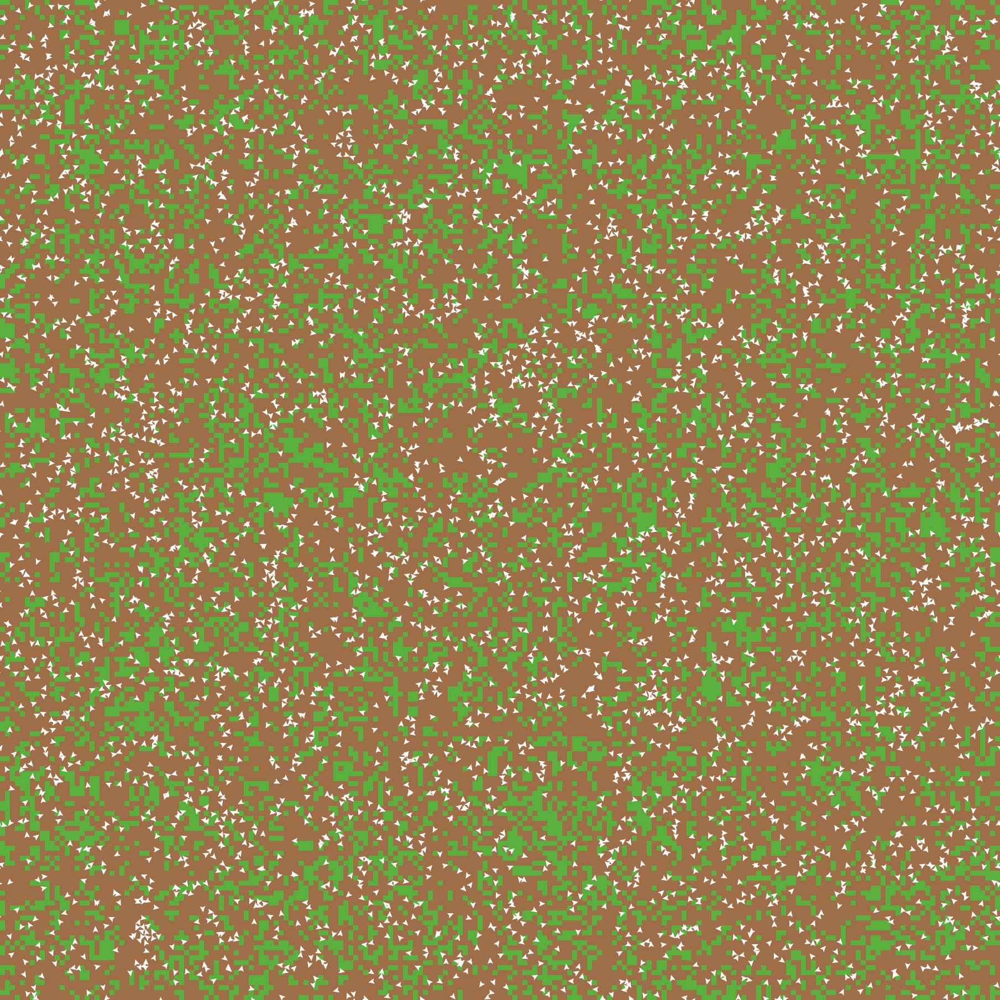

% Report on HLogo (NetLogo clone in Haskell)
% Nikolaos Bezirgiannis, Ilias Sakellariou, Wishnu Prasetya
% 10/04/2013

# News

- Fixed bugs here and there
- Ran 3 new benchmarks

# Results of Benchmarking

## Sheep1 Model

### Description

100 sheep turtles move around a 100x100 torus eating grass (turning patches from green to brown). 
Grass regrows at a certain level (from brown to green). Stop after 10000 ticks.

### NetLogo code
~~~ {.numberLines}
;; Sheep and wolves are both breeds of turtle.
breed [sheep a-sheep]  ;; sheep is its own plural, so we use "a-sheep" as the singular.
turtles-own [energy]       ;; both wolves and sheep have energy
patches-own [countdown]

to setup
  reset-timer
  clear-all
  ask patches [ set pcolor green ]
  ;; check GRASS? switch.
  ;; if it is true, then grass grows and the sheep eat it
  ;; if it false, then the sheep don't need to eat
  if grass? [
    ask patches [
      set countdown random grass-regrowth-time ;; initialize grass grow clocks randomly
      set pcolor one-of [green brown]
    ]
  ]
  create-sheep initial-number-sheep  ;; create the sheep, then initialize their variables
  [
    set color white
    set size 1.5  ;; easier to see
    set label-color blue - 2
    set energy random (2 * sheep-gain-from-food)
    setxy random-xcor random-ycor
  ]
  reset-ticks
end

to go
  if ticks > 10000 [print count sheep print timer stop]
  if not any? turtles [ stop ]
  ask sheep [
    move
    if grass? [
      set energy energy - 1  ;; deduct energy for sheep only if grass? switch is on
      eat-grass
    ]
  ]
  if grass? [ ask patches [ grow-grass ] ]
  ;set grass count patches with [pcolor = green]
  tick
end

to move  ;; turtle procedure
  rt random 50
  lt random 50
  fd 1
end

to eat-grass  ;; sheep procedure
  ;; sheep eat grass, turn the patch brown
  if pcolor = green [
    set pcolor brown
    set energy energy + sheep-gain-from-food  ;; sheep gain energy by eating
  ]
end

to grow-grass  ;; patch procedure
  ;; countdown on brown patches: if reach 0, grow some grass
  if pcolor = brown [
    ifelse countdown <= 0
      [ set pcolor green
        set countdown grass-regrowth-time ]
      [ set countdown countdown - 1 ]
  ]
end
; Copyright 1997 Uri Wilensky.
; See Info tab for full copyright and license.
~~~

### Translated HLogo code

~~~ {.haskell .numberLines}
globals []
patches_own ["countdown"]
breeds ["sheep", "a_sheep"]
breeds_own "sheep" ["senergy"]

-- Model Parameters
grassp = True
grass_regrowth_time = 30
initial_number_sheep = 100
initial_number_wolves = 0
sheep_gain_from_food = 4
wolf_gain_from_food = 20
sheep_reproduce = 4
wolf_reproduce = 5

setup = do
  ask_ (atomic $ set_pcolor green) =<< unsafe_patches
  when grassp $ ask_ (do
                       r <- unsafe_random grass_regrowth_time
                       c <- liftM head (unsafe_one_of [green, brown])
                       atomic $ do
                         set_countdown r
                         set_pcolor c
                     ) =<< unsafe_patches

  s <- atomic $ create_sheep initial_number_sheep
  ask_ (do
          s <- unsafe_random (2 * sheep_gain_from_food)
          x <- unsafe_random_xcor
          y <- unsafe_random_ycor
          atomic $ do
            set_color white
            set_size 1.5
            set_label_color (blue -2)
            set_senergy s
            setxy x y
       ) s
  atomic $ reset_ticks

go = forever $ do
  t <- unsafe_ticks
  when (t > 10000) (unsafe_sheep >>= count >>= unsafe_print_ >> stop)
  ask_ (do
         move
         e <- unsafe_senergy
         when grassp $ do
            atomic $ set_senergy (e -1)
            eat_grass
       ) =<< unsafe_sheep
  when grassp (ask_ grow_grass =<< unsafe_patches)
  atomic $ tick

move = do
  r <- unsafe_random 50
  l <- unsafe_random 50
  atomic $ do
         rt r
         lt l
         fd 1

eat_grass = do
  c <- unsafe_pcolor
  when (c == green) $ do
              atomic $ set_pcolor brown
              atomic $ with_senergy (+ sheep_gain_from_food)

grow_grass = do
  c <- unsafe_pcolor
  when (c == brown) $ do
               d <- unsafe_countdown
               atomic $ if (d <= 0)
                        then set_pcolor green >> set_countdown grass_regrowth_time
                        else set_countdown $ d -1

               
run ['setup, 'go]
~~~

### Results

- Benchmark Results on win 32bit (intel i7 3537U)

Model       NetLogo (secs)  NetLogo (JVM bytecode)  HLogo (1-core)  HLogo (2-cores) 
-----       --------------  ----------------------  --------------  ---------------
Sheep1      80              78                      85              57.9

## Sheep2 Model

### Description

Slightly modified Sheep1 model, where sheep die if they are not eating enough and reproduce if they are eating a lot. 
The model starts with 100 sheep. It reaches a sustainable level of approximately 4000 sheep. Stop after 1000 ticks.

### NetLogo code

~~~ {.numberLines}
;; Sheep and wolves are both breeds of turtle.
breed [sheep a-sheep]  ;; sheep is its own plural, so we use "a-sheep" as the singular.
turtles-own [energy]       ;; both wolves and sheep have energy
patches-own [countdown]

to setup
  reset-timer
  clear-all
  ask patches [ set pcolor green ]
  ;; check GRASS? switch.
  ;; if it is true, then grass grows and the sheep eat it
  ;; if it false, then the sheep don't need to eat
  if grass? [
    ask patches [
      set countdown random grass-regrowth-time ;; initialize grass grow clocks randomly
      set pcolor one-of [green brown]
    ]
  ]
  create-sheep initial-number-sheep  ;; create the sheep, then initialize their variables
  [
    set color white
    set size 1.5  ;; easier to see
    set label-color blue - 2
    set energy random (2 * sheep-gain-from-food)
    setxy random-xcor random-ycor
  ]
  reset-ticks
end

to go
  if ticks > 1000 [print count sheep print timer stop]
  if not any? turtles [ stop ]
  ask sheep [
    move
    if grass? [
      set energy energy - 1  ;; deduct energy for sheep only if grass? switch is on
      eat-grass
    ]
    death
    reproduce-sheep
  ]
  if grass? [ ask patches [ grow-grass ] ]
  ;set grass count patches with [pcolor = green]
  tick
end

to move  ;; turtle procedure
  rt random 50
  lt random 50
  fd 1
end

to eat-grass  ;; sheep procedure
  ;; sheep eat grass, turn the patch brown
  if pcolor = green [
    set pcolor brown
    set energy energy + sheep-gain-from-food  ;; sheep gain energy by eating
  ]
end

to reproduce-sheep  ;; sheep procedure
  if random-float 100 < sheep-reproduce [  ;; throw "dice" to see if you will reproduce
    set energy (energy / 2)                ;; divide energy between parent and offspring
    hatch 1 [ rt random-float 360 fd 1 ]   ;; hatch an offspring and move it forward 1 step
  ]
end

to death  ;; turtle procedure
  ;; when energy dips below zero, die
  if energy < 0 [ die ]
end

to grow-grass  ;; patch procedure
  ;; countdown on brown patches: if reach 0, grow some grass
  if pcolor = brown [
    ifelse countdown <= 0
      [ set pcolor green
        set countdown grass-regrowth-time ]
      [ set countdown countdown - 1 ]
  ]
end
; Copyright 1997 Uri Wilensky.
; See Info tab for full copyright and license.
~~~

### Translated HLogo code

~~~ {.haskell}
globals []
patches_own ["countdown"]
breeds ["wolves", "wolf"]
breeds ["sheep", "a_sheep"]
breeds_own "wolves" ["wenergy"]
breeds_own "sheep" ["senergy"]

-- Model Parameters
grassp = True
grass_regrowth_time = 30
initial_number_sheep = 100
initial_number_wolves = 0
sheep_gain_from_food = 4
wolf_gain_from_food = 20
sheep_reproduce = 4
wolf_reproduce = 5

setup = do
  ask_ (atomic $ set_pcolor green) =<< unsafe_patches
  when grassp $ ask_ (do
                       r <- unsafe_random grass_regrowth_time
                       c <- liftM head (unsafe_one_of [green, brown])
                       atomic $ do
                         set_countdown r
                         set_pcolor c
                     ) =<< unsafe_patches

  s <- atomic $ create_sheep initial_number_sheep
  ask_ (do
          s <- unsafe_random (2 * sheep_gain_from_food)
          x <- unsafe_random_xcor
          y <- unsafe_random_ycor
          atomic $ do
            set_color white
            set_size 1.5
            set_label_color (blue -2)
            set_senergy s
            setxy x y
       ) s
  atomic $ reset_ticks

go = forever $ do
  t <- unsafe_ticks
  when (t > 1000) (unsafe_sheep >>= count >>= unsafe_print_ >> stop)
  ask_ (do
         move
         e <- unsafe_senergy
         when grassp $ do
            atomic $ set_senergy (e -1)
            eat_grass
         if (e-1 < 0 && grassp) then (atomic die) else reproduce_sheep
       ) =<< unsafe_sheep
  when grassp (ask_ grow_grass =<< unsafe_patches)
  atomic $ tick

move = do
  r <- unsafe_random 50
  l <- unsafe_random 50
  atomic $ do
         rt r
         lt l
         fd 1

eat_grass = do
  c <- unsafe_pcolor
  when (c == green) $ do
              atomic $ set_pcolor brown
              atomic $ with_senergy (+ sheep_gain_from_food)

reproduce_sheep = do
  r <- unsafe_random_float 100
  when (r < sheep_reproduce) $ do
                    w <- atomic $ with_senergy (/ 2) >> hatch 1
                    ask_ ((unsafe_random_float 360 >>= \ r -> atomic (rt r >> fd 1))) w

grow_grass = do
  c <- unsafe_pcolor
  when (c == brown) $ do
               d <- unsafe_countdown
               atomic $ if (d <= 0)
                        then set_pcolor green >> set_countdown grass_regrowth_time
                        else set_countdown $ d -1

               
run ['setup, 'go]
~~~

### Results

- Benchmark Results on win 32bit (intel i7 3537U)

Model       NetLogo (secs)  NetLogo (JVM bytecode)  HLogo (1-core)  HLogo (2-cores, 4 threads) 
-----       --------------  ----------------------  --------------  ---------------
Sheep2      20.6            18.5                    67              35.5

### Comments

It looks like the  HLogo version is roughly 2 times slower. It's because either of two cases happening:

1) The `hatch` primitive that `reproduce-sheep` calls is slow or wrongly implemented in HLogo
2) Because there is a 4000 population in a 100x100 torus, that means that
there are a lot of sheep that are on the same patch. If there is more than 1 sheep trying to eat a grass, they will conflict and trigger STM rollbacks. E.g.:

~~~
sheep 1 tries to eat patch 0 0 at time t
sheep 2 tries to eat patch 0 0 at time t
sheep 3 tries to eat patch 0 0 at time t
rollback sheep 1
rollback sheep 2
rollback sheep 3
sheep 1 tries to eatch patch 0 0 at time t+1
sheep 2 tries to eatch patch 0 0 at time t+2
sheep 3 tries to eatch patch 0 0 at time t+3
Resolved
~~~

That means that sheeps on the same patch are sequentialised. That's what I suspect that is happening. Although the model does not look sequential (like Sheep1 model), it happens to be sequential, because the sheep are occupying a shared grid of patches. 

## Fire model

### Description

A fire spreads from left to right on a dense forest (300x300 box). 
Turtles are sprouted as fires then turn to embers then killed. Stop the simulation after 500 ticks.

### NetLogo code

~~~ {.numberLines}
globals [
  initial-trees   ;; how many trees (green patches) we started with
  burned-trees    ;; how many have burned so far
]

breed [fires fire]    ;; bright red turtles -- the leading edge of the fire
breed [embers ember]  ;; turtles gradually fading from red to near black

to setup
  reset-timer 
  clear-all
  ;set-default-shape turtles "square"
  ;; make some green trees
  ask patches with [(random-float 100) < density]
    [ set pcolor green ]
  ;; make a column of burning trees
  ask patches with [pxcor = min-pxcor]
    [ ignite ]
  ;; set tree counts
  set initial-trees count patches with [pcolor = green]
  set burned-trees 0
  reset-ticks
end

to go
  ;;if not any? turtles  ;; either fires or embers
    ;;[ stop ]
  if  ticks > 500 [  print timer stop]
  ask fires
    [ ask neighbors4 with [pcolor = green]
        [ ignite ]
      set breed embers ]
  fade-embers
  tick
end

;; creates the fire turtles
to ignite  ;; patch procedure
  sprout-fires 1
    [ set color red ]
  set pcolor black
  set burned-trees burned-trees + 1
end

;; achieve fading color effect for the fire as it burns
to fade-embers
  ask embers
    [ set color color - 0.3  ;; make red darker
      if color < red - 3.5     ;; are we almost at black?
        [ set pcolor color
          die ] ]
end
; Copyright 1997 Uri Wilensky.
; See Info tab for full copyright and license.
~~~

### Translated HLogo code

~~~ {.haskell .numberLines}
globals ["initial_trees", "burned_trees"]
patches_own []
turtles_own []
breeds ["fires", "fire"]
breeds ["embers", "ember"]
breeds_own "fires" []
breeds_own "embers" []

setup = do
  ask_ (atomic $ set_pcolor green) =<< (with (liftM (< 99) (unsafe_random_float 100)) =<< unsafe_patches)
  ask_ ignite =<< (with (liftM2 (==) pxcor min_pxcor ) =<< unsafe_patches)
  sit <- count =<< (with (liftM (== green) unsafe_pcolor) =<< unsafe_patches)
  atomic $ set_initial_trees (fromIntegral sit)
  atomic $ set_burned_trees 0
  atomic $ reset_ticks

go = forever $ do
  ts <- unsafe_ticks
  when (ts > 500) (stop)
  ask_ (do
         ask_ ignite =<< (with (liftM (== green) unsafe_pcolor) =<< atomic neighbors4)
         atomic $ set_breed "embers"
       ) =<< unsafe_fires
  fade_embers
  atomic $ tick

ignite = do
  s <- atomic $ sprout_fires 1
  ask_ (atomic $ set_color red) s
  atomic $ set_pcolor black
  atomic $ with_burned_trees (+1)

fade_embers = do
  ask_ (atomic $ do
          c <- liftM (\ x -> x - 0.3) color
          set_color c
          if c < red - 3.5 then set_pcolor c >> die else return ()) =<< unsafe_embers

run ['setup, 'go]
~~~

### Results

- Benchmark Results on win 32bit (intel i7 3537U)

Model       NetLogo (secs)  NetLogo (JVM bytecode)  HLogo (1-core)  HLogo (2-cores, 4 threads) 
-----       --------------  ----------------------  --------------  ---------------
Fire        7.9             4.1                     13.3            8.7

